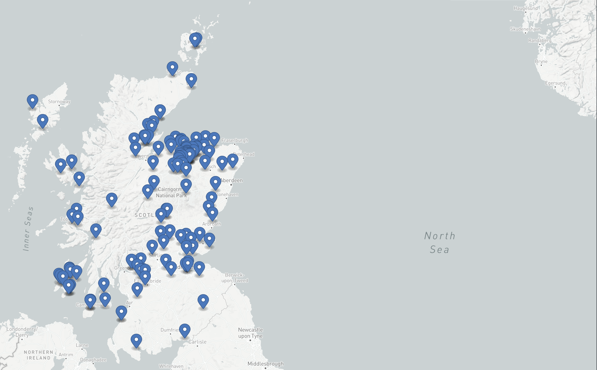

# Completely Smashed

A data set of Scottish Whisky Distilleries

## Usage

For JSON format, query the following URL

```
https://raw.githubusercontent.com/mhamilt/completely-smashed/main/completely-smashed.json
```

The data set is a JSON array of distillery objects, which at a minimum should contain

```json
{
    "Name": "Ardbeg Distillery",
    "Owner": "Glenmorangie Company Ltd",
    "Description": "Islay Malt",
    "Url": "https://www.ardbeg.com/en-gb",
    "Address": "Isle of Islay",
    "Postcode": "PA42 7EB",
    "Lat": "55.6399588",
    "Lng": "-6.1102298"
}
```

### GeoJson

The data has also been compliled into standard GeoJson format. The map is rendered [directly on GitHub](https://github.com/mhamilt/completely-smashed/blob/main/completely-smashed.geojson)

